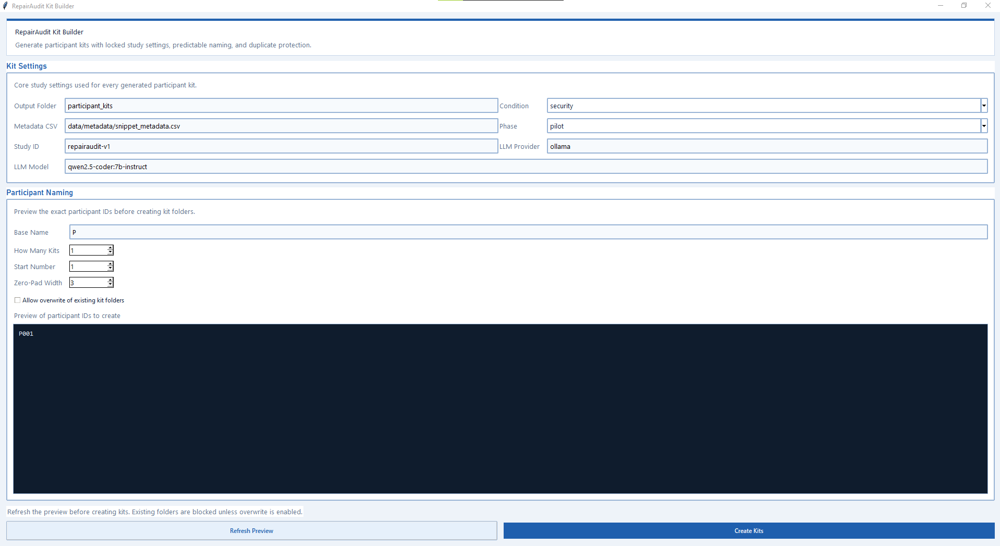
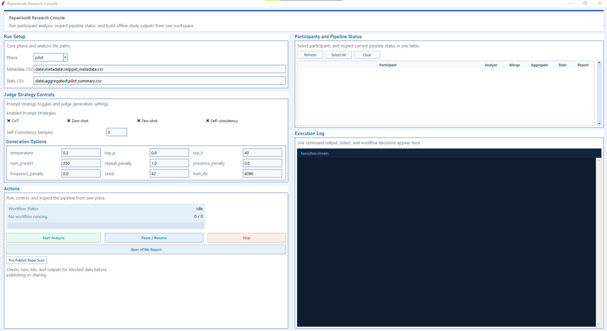

# RepairAudit: Auditing Human-LLM Vulnerability Mitigation in Code Repair Workflows

Repository for a controlled experiment on how humans edit vulnerable Python snippets with LLM assistance.

This README is the operator and developer handbook for the full pipeline: kit generation, participant collection, analysis, aggregation, and reporting.

## 1) What This Project Measures
This pipeline evaluates whether participant edits:
- mitigate vulnerabilities
- preserve vulnerabilities
- amplify risk
- produce uncertainty/disagreement signals

Vulnerability scope:
- SQL Injection (`CWE-89`)
- Command Injection (`CWE-78`)

Core study idea:
- baseline snippets are intentionally vulnerable starting points
- participants edit those snippets with LLM assistance
- results are judged by deterministic detectors plus optional LLM-as-a-judge
- workflow telemetry is merged so security outcomes can be linked to behavior

## 2) Repository Layout
```text
RepairAudit/
|-- config.yaml                              # Runtime config (LLM judge model, strategies, generation options)
|-- requirements.txt                         # Python dependencies
|-- README.md                                # This researcher/operator/developer guide
|-- Run_Privacy_Check.bat                    # One-click privacy pre-publish gate
|-- .gitignore                               # Prevents participant data/artifacts from accidental commit
|
|-- gui/
|   |-- study_gui.py                         # Researcher analysis GUI (multi-participant pipeline runner)
|   `-- kit_builder_gui.py                   # Researcher participant-kit GUI (batch kit creation)
|
|-- scripts/
|   |-- study_cli.py                         # Unified CLI entrypoint for all workflow stages
|   |-- participant_kit.py                   # Kit builder and kit cleanup logic
|   |-- participant_web_app_template.py      # Template copied into each kit as participant_web_app.py
|   |-- privacy_check.py                     # Pre-publish privacy scanner used by CLI and BAT wrapper
|   `-- __init__.py                          # Package marker
|
|-- tools/
|   |-- analysis/
|   |   |-- analyze_edits.py                 # Per-snippet scoring orchestration
|   |   |-- detectors.py                     # Deterministic SQLi/CMDi heuristics
|   |   |-- llm_judge.py                     # Strategy-aware LLM judge + prompt construction
|   |   |-- interaction.py                   # Merge snippet_log.csv fields into results.csv
|   |   |-- metrics.py                       # Build summary.json and summary.txt from results.csv
|   |   |-- stats.py                         # Aggregate descriptive/inferential stats helpers
|   |   `-- __init__.py
|   |
|   |-- instrumentation/
|   |   |-- capture_env.py                   # Public-safe environment snapshot
|   |   |-- diff_runner.py                   # Unified diffs + line-change counts
|   |   |-- snippet_timer.py                 # Optional per-snippet timing event writer
|   |   |-- start_timer.py                   # Run-level start/end timing writer
|   |   `-- __init__.py
|   |
|   |-- reporting/
|   |   |-- html_report.py                   # Aggregated offline HTML report generator
|   |   `-- __init__.py
|   |
|   |-- validators/
|   |   `-- bandit_runner.py                 # Bandit wrapper for validation signal
|   `-- __init__.py
|
|-- snippets/
|   |-- baseline/                            # Vulnerable source snippets copied into runs/kits
|   |-- gold/                                # Secure reference snippets for judge context
|   `-- prompts/task_descriptions.md         # Task framing text
|
|-- data/
|   |-- metadata/snippet_metadata.csv        # Snippet registry used by kit generation and analysis
|   |-- raw/.keep                            # Placeholder
|   `-- aggregated/.keep                     # Placeholder for generated aggregate artifacts
|
|-- participant_kits/                        # Generated participant distribution kits
`-- runs/                                    # Imported participant submissions + per-run outputs
```

## 3) Environment Setup (Windows)
```powershell
git clone https://github.com/SudoKudo/RepairAudit.git
cd RepairAudit
py -3 -m venv venv
venv\Scripts\activate
venv\Scripts\python.exe -m pip install -r requirements.txt
```
If `py` is unavailable on your machine, use your installed Python launcher for
that one environment-creation step. After the environment exists, use
`venv\Scripts\python.exe` for all project commands so the pipeline does not
depend on global PATH state.

Dependencies in `requirements.txt`:
- `bandit>=1.7.0`
- `pandas>=2.0.0`
- `numpy>=1.24.0`
- `scipy>=1.10.0`
- `pyyaml>=6.0`
- `jinja2>=3.1.0`

## 3.1) GitHub Publish Checklist
Before publishing this repository, remove or ignore generated study artifacts:
- `participant_kits/` contents
- `runs/` contents
- `data/aggregated/` outputs
- `tmp_*/` scratch folders
- root helper scripts prefixed with `_`

The tracked repository should contain source, metadata, snippets, config, and documentation. Participant data, generated kits, and analysis outputs should remain local-only.

Note:
- `venv/` is a local-only environment and is intentionally gitignored.
- `gui/.cache/` stores local Study GUI session state and is intentionally gitignored.

## 4) Pipeline Flow
Researcher flow:
1. Generate participant kits.
2. Distribute kits.
3. Receive participant ZIP submissions.
4. Extract each returned submission ZIP into `runs/<phase>/` so the archive creates `runs/<phase>/<participant_id>/`.
5. Analyze each run.
6. Merge interaction logs.
7. Aggregate pilot metrics.
8. Compute stats.
9. Build HTML report.

One-command map (high level):
```powershell
venv\Scripts\python.exe -m scripts.study_cli build-participant-kit ...
venv\Scripts\python.exe -m scripts.study_cli analyze-run ...
venv\Scripts\python.exe -m scripts.study_cli merge-interaction ...
venv\Scripts\python.exe -m scripts.study_cli aggregate-pilot
venv\Scripts\python.exe -m scripts.study_cli compute-stats
venv\Scripts\python.exe -m scripts.study_cli build-report
```

## 5) CLI Command Map
Use the GUI first when possible. The CLI remains available for scripted or manual execution.

### Participant kit creation
- `build-participant-kit`: create a participant kit under `participant_kits/`
- `make-test-runs`: generate disposable synthetic runs for testing

### Per-run analysis
- `analyze-run`: score one participant run and write `analysis/` plus `diffs/`
- `merge-interaction`: merge `snippet_log.csv` and participant metadata into analyzed results

### Aggregate outputs
- `aggregate-pilot`: build `data/aggregated/pilot_summary.csv`
- `compute-stats`: compute descriptive statistics from `pilot_summary.csv`
- `build-report`: render the offline HTML report

### Utilities
- `privacy-check`: scan the repo for participant data or secret-like content before publish

## 6) Data Contracts
### 6.1 Snippet metadata contract
File: `data/metadata/snippet_metadata.csv`

Columns used by kit generation:
- `snippet_id`
- `baseline_relpath`

Columns used by analysis/judge:
- `snippet_id`
- `vuln_type`
- `cwe`
- `baseline_relpath`
- `gold_relpath`

Recommended descriptive columns:
- `task_short`
- `notes`

### 6.2 Run folder contract
Each analyzed run should contain:
- `runs/<phase>/<participant_id>/edits/*.py`
- `runs/<phase>/<participant_id>/logs/snippet_log.csv`
- `runs/<phase>/<participant_id>/logs/chat_log.jsonl`
- `runs/<phase>/<participant_id>/condition.txt`

Generated by analysis:
- `runs/<phase>/<participant_id>/analysis/*`
- `runs/<phase>/<participant_id>/diffs/*`

## 7) How `snippet_metadata.csv` Gets Updated
`snippet_metadata.csv` is a source-of-truth input file. It is not auto-generated by default.

Update process:
1. Add or modify snippet source files in:
   - `snippets/baseline/<type>/...`
   - `snippets/gold/<type>/...`
2. Edit `data/metadata/snippet_metadata.csv`:
   - add/update row per snippet
   - ensure required columns are filled
3. Generate a new participant kit.
4. Run one dry analysis to verify no missing paths.

Important behavior:
- New kits reflect whatever metadata/baseline files exist at generation time.
- Existing kits are snapshots and do not auto-update.

## 8) Participant Kit Generation and Behavior
### 8.1 Build kits
GUI (primary option):
```powershell
venv\Scripts\python.exe gui\kit_builder_gui.py
```
Use the GUI to:
- choose output folder, condition, phase, and model settings
- preview participant IDs before writing folders
- create one or more participant kits in one pass



CLI (secondary option):
```powershell
venv\Scripts\python.exe -m scripts.study_cli build-participant-kit ^
  --participant_id P101 ^
  --condition security ^
  --phase pilot ^
  --metadata_csv data/metadata/snippet_metadata.csv ^
  --out_root participant_kits
```

Default behavior:
- GUI defaults to `security`.
- CLI defaults to `security` if `--condition` is not provided.

### 8.2 What is inside a kit
```text
participant_kits/<participant_id>/
|-- README.md
|-- study_config.lock.json
|-- participant_web_app.py
|-- Launch_Study_Web_App.bat
|-- Launch_Study_Web_App.sh
|-- package_submission.py
|-- exports/
`-- run_<phase>_<participant_id>/
    |-- baseline/*.py
    |-- edits/*.py
    |-- logs/participant_profile.json
    |-- logs/snippet_log.csv
    |-- logs/chat_log.jsonl
    |-- condition.txt
    `-- start_end_times.json
```

### 8.3 Participant web app notes
- Web app is dynamic by snippet list, not hardcoded to 8 snippets.
- Snippet content is loaded per snippet request, not all code at once.
- Participants do all task work inside the browser app: edit code, use Ollama, save snippet summaries, and build the return ZIP.

### 8.4 Distribute a participant kit
1. Build the kit into `participant_kits/<participant_id>/`.
2. Zip that folder or send the folder as-is.
3. Tell the participant to:
   - install Ollama
   - run `ollama pull <assigned model>` once
   - keep `ollama serve` running while completing the study
   - launch `Launch_Study_Web_App.bat`
   - complete every snippet and use `Finish (Build ZIP)` at the end
4. The participant returns the ZIP created in the kit's `exports/` folder.

### 8.5 Receive a completed participant return
1. Copy the returned ZIP into a temporary staging location.
2. Extract it into `runs/<phase>/` so the extracted folder becomes `runs/<phase>/<participant_id>/`.
3. Verify the extracted run contains:
   - `edits/*.py`
   - `logs/snippet_log.csv`
   - `logs/chat_log.jsonl`
   - `condition.txt`
4. Only after that should you run `analyze-run` and `merge-interaction`.

## 9) Controlled LLM Judge Configuration
Primary file:
- `config.yaml`

Prompt strategies:
- `cot`
- `zero_shot`
- `few_shot`
- `self_consistency`

Execution modes:
- `strategy_mode: single`
- `strategy_mode: ensemble`

Where prompts are built:
- `tools/analysis/llm_judge.py`
  - `_build_base_system_prompt`
  - `_build_decision_policy`
  - `_build_prompt`
  - `_resolve_strategy_plan`

## 10) How to Make Common Changes
### 10.1 Add new snippets
1. Add baseline and gold `.py` files.
2. Add metadata row with valid paths and `vuln_type/cwe`.
3. Generate a fresh kit.
4. Run:
   - `analyze-run` on one test run
   - `build-report` to ensure new snippet appears

### 10.2 Change participant form fields
Edit:
- `scripts/participant_web_app_template.py` (UI and API payload)
- `scripts/participant_kit.py` (`_participant_log_fieldnames`, CSV template)
- `tools/analysis/interaction.py` (merge logic for new columns)

Then regenerate kits.

### 10.3 Change LLM prompt strategies
Edit:
- `config.yaml` for enable/disable and vote policy
- `tools/analysis/llm_judge.py` for prompt text/logic

Then rerun:
- `analyze-run`
- `aggregate-pilot`
- `build-report`

### 10.4 Add a new aggregate metric
1. Compute metric in `scripts/study_cli.py` inside `cmd_aggregate_pilot`.
2. Add column to `fieldnames`.
3. Update `tools/analysis/stats.py` if metric should appear in statistical summary.
4. Update `tools/reporting/html_report.py` to display/filter it.

### 10.5 Change report layout
Edit:
- `tools/reporting/html_report.py`

Then rebuild:
```powershell
venv\Scripts\python.exe -m scripts.study_cli build-report --phase pilot
```

## 11) Researcher Runbook
### 11.1 Preferred workflow: Study GUI
```powershell
venv\Scripts\python.exe gui\study_gui.py
```
Use the Study GUI to:
1. Set `Phase`, `Metadata CSV`, and judge strategy settings.
2. Extract returned participant ZIPs into `runs/<phase>/`.
3. Click `Refresh Participants` to load the current run folders.
4. Review the combined participant/pipeline status table.
5. Use `Start Analysis` to run analyze, merge, aggregate, stats, and report generation for the selected phase.
6. Use `Open HTML Report` after the run completes.



### 11.2 Equivalent CLI workflow
#### Receive participant zip and ingest
1. Extract the returned submission ZIP into `runs/<phase>/`.
2. Verify required files exist under `runs/<phase>/<participant_id>/`:
   - `edits/*.py`
   - `logs/snippet_log.csv`
   - `logs/chat_log.jsonl`
   - `condition.txt`

#### Analyze one participant
```powershell
venv\Scripts\python.exe -m scripts.study_cli analyze-run --participant_id P101 --phase pilot --metadata_csv data/metadata/snippet_metadata.csv
venv\Scripts\python.exe -m scripts.study_cli merge-interaction --run_dir runs/pilot/P101
```

#### Aggregate all participants and build outputs
```powershell
venv\Scripts\python.exe -m scripts.study_cli aggregate-pilot
venv\Scripts\python.exe -m scripts.study_cli compute-stats --in_csv data/aggregated/pilot_summary.csv
venv\Scripts\python.exe -m scripts.study_cli build-report --phase pilot --out_html data/aggregated/report.html
```

## 12) Key Outputs
Per participant:
- `runs/<phase>/<id>/analysis/results.csv`
- `runs/<phase>/<id>/analysis/summary.json`
- `runs/<phase>/<id>/analysis/summary.txt`
- `runs/<phase>/<id>/analysis/bandit.json`
- `runs/<phase>/<id>/diffs/*.diff`

Aggregated:
- `data/aggregated/pilot_summary.csv`
- `data/aggregated/pilot_stats.txt`
- `data/aggregated/report.html`

Aggregate metrics currently emitted:
- `mitigations_per_minute`
- `time_to_first_secure_fix_seconds`
- `judge_strategy_variance`
- `judge_strategy_variance_snippets`

## 13) Validation and Maintenance Commands
Show CLI help:
```powershell
venv\Scripts\python.exe -m scripts.study_cli --help
```

Compile sanity check:
```powershell
venv\Scripts\python.exe -m compileall scripts tools gui
```

Synthetic pipeline smoke test:
```powershell
venv\Scripts\python.exe -m scripts.study_cli make-test-runs --core-only
venv\Scripts\python.exe -m scripts.study_cli aggregate-pilot
venv\Scripts\python.exe -m scripts.study_cli compute-stats
venv\Scripts\python.exe -m scripts.study_cli build-report
```

Clean participant kits:
```powershell
venv\Scripts\python.exe -m scripts.study_cli clean-participant-kits --out_root participant_kits --all --dry_run
venv\Scripts\python.exe -m scripts.study_cli clean-participant-kits --out_root participant_kits --all
```

## 14) Security and IRB-Oriented Controls
- Participant app is local-only by default (`127.0.0.1`).
- Participant app uses origin and CSRF checks for POST endpoints.
- Packaging validates schema and builds hash manifest.
- Privacy reminder is visible in participant UI.
- Pre-publish privacy scanner prevents common accidental leaks.


Important:
- These controls support IRB risk mitigation, but formal compliance still depends on approved protocol, consent language, and institution policy.

## 15) One-Click Privacy Gate (Before Publish)
```powershell
Run_Privacy_Check.bat
```

CLI equivalent:
```powershell
venv\Scripts\python.exe -m scripts.study_cli privacy-check
```

The check fails (`exit code 1`) if blocked participant-data paths or high-confidence secret signatures are found.

## 16) Troubleshooting
### `merge-interaction` fails with missing `snippet_log.csv`
Expected:
- `runs/<phase>/<participant_id>/logs/snippet_log.csv`

### Participant web app does not open
- check Python install on participant machine
- re-run `Launch_Study_Web_App.bat`
- ensure local port `8765` is available
- ensure Ollama is installed and running (`ollama serve`)

### Report does not show latest values
Re-run in order:
1. `analyze-run`
2. `merge-interaction`
3. `aggregate-pilot`
4. `compute-stats`
5. `build-report`
