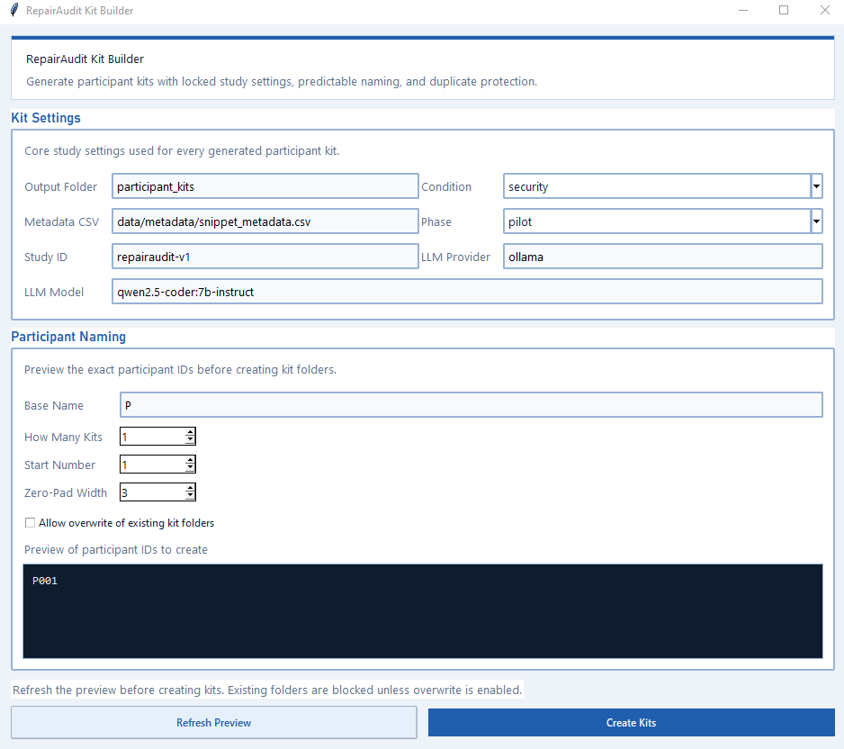
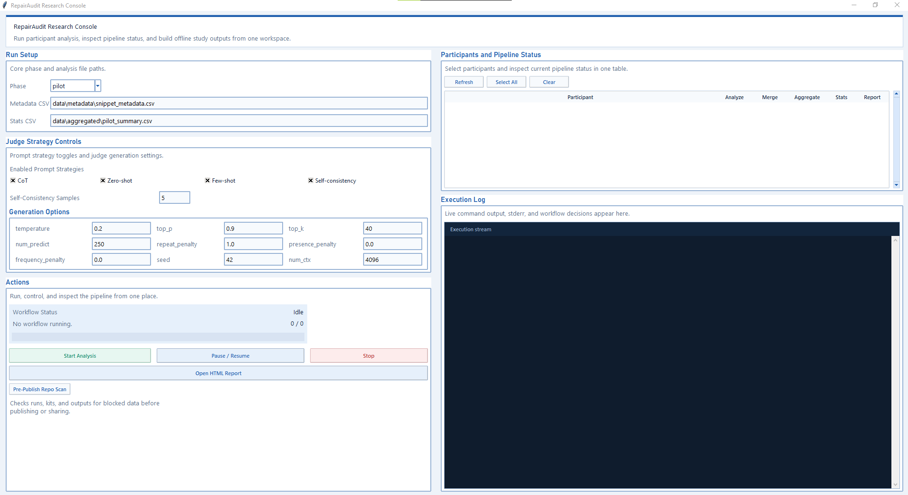

# RepairAudit: Auditing Human-LLM Vulnerability Mitigation in Code Repair Workflows

This repository holds the study pipeline, the participant-kit builder, and the analysis/reporting code for RepairAudit.

Use this README as the working reference for setup, kit generation, submission ingest, analysis, and publish checks.

## 1) What The Repo Does
The pipeline tracks what happens after a participant receives vulnerable code, works on it with the assigned LLM workflow, and returns a submission. The main outcome labels are:
- mitigate vulnerabilities
- preserve vulnerabilities
- amplify risk
- produce uncertainty/disagreement signals

Current checked-in vulnerability coverage:
- SQL Injection (`CWE-89`)
- Command Injection (`CWE-78`)

In practice, the repo does five jobs:
- baseline snippets are intentionally vulnerable starting points
- participant kits package those snippets with the local web app and locked LLM settings
- returned runs are analyzed with deterministic detectors and, if enabled, an LLM judge
- interaction logs are merged into the per-snippet results
- aggregate outputs and the HTML report are built from the imported runs

The checked-in sample corpus includes Python, Java, C, and C++. The dataset-driven kit flow is language-agnostic as long as the source CSV has the required columns.

## 2) Repository Layout
```text
RepairAudit/
|-- config.yaml                              # Runtime config (LLM judge model, strategies, generation options)
|-- requirements.txt                         # Python dependencies
|-- README.md                                # Project setup, workflow, and publish checks
|-- .gitignore                               # Prevents participant data/artifacts from accidental commit
|
|-- gui/
|   |-- study_gui.py                         # Researcher analysis GUI (multi-participant pipeline runner)
|   `-- kit_builder_gui.py                   # Researcher participant-kit GUI (batch kit creation)
|
|-- scripts/
|   |-- study_cli.py                         # Unified CLI entrypoint for all workflow stages
|   |-- participant_kit.py                   # Kit builder and kit cleanup logic
|   |-- participant_web_app_template.py      # Template copied into each kit as participant_web_app.py
|   |-- privacy_check.py                     # Pre-publish privacy scanner used by the CLI and researcher GUI
|   `-- __init__.py                          # Package marker
|
|-- tools/
|   |-- analysis/
|   |   |-- analyze_edits.py                 # Per-snippet scoring orchestration
|   |   |-- detectors.py                     # Deterministic SQLi/CMDi heuristics
|   |   |-- llm_judge.py                     # Strategy-aware LLM judge + prompt construction
|   |   |-- interaction.py                   # Merge snippet_log.csv fields into results.csv
|   |   |-- metrics.py                       # Build summary.json and summary.txt from results.csv
|   |   |-- modeling.py                      # Snippet-level modeling dataset + local fixed-effects logit
|   |   |-- stats.py                         # Aggregate descriptive/inferential stats helpers
|   |   `-- __init__.py
|   |
|   |-- instrumentation/
|   |   |-- capture_env.py                   # Public-safe environment snapshot
|   |   |-- diff_runner.py                   # Unified diffs + line-change counts
|   |   |-- snippet_timer.py                 # Optional per-snippet timing event writer
|   |   |-- start_timer.py                   # Run-level start/end timing writer
|   |   `-- __init__.py
|   |
|   |-- reporting/
|   |   |-- html_report.py                   # Aggregated offline HTML report generator
|   |   `-- __init__.py
|   |
|   |-- domain_classification/
|   |   |-- classify.py                      # Append expertise labels to a raw CWE/sample dataset with Ollama
|   |   |-- verify_class_distribution.py     # Quick distribution sanity check for classified datasets
|   |   |-- expertise_areas.jsonl            # Closed expertise taxonomy used by classifier and kit builder
|   |   `-- dataset_classified.zip           # Downloadable archive copy of the large classified dataset
|   |
|   |-- validators/
|   |   `-- bandit_runner.py                 # Bandit wrapper for validation signal
|   `-- __init__.py
|
|-- snippets/
|   |-- baseline/                            # Vulnerable source snippets copied into runs/kits
|   |-- gold/                                # Secure reference snippets for judge context
|   `-- prompts/task_descriptions.md         # Task framing text
|
|-- data/
|   |-- metadata/snippet_metadata.csv        # Snippet registry used by kit generation and analysis
|   |-- datasets/classified/                 # Local-only large dataset CSVs used for dataset-backed kit sampling
|   |-- raw/.keep                            # Placeholder
|   `-- aggregated/.keep                     # Placeholder for generated aggregate artifacts
|
|-- docs/figures/                            # README screenshots
|-- tests/                                   # Focused regression tests for classifier, metrics, kit selection, privacy
|-- participant_kits/                        # Generated participant distribution kits
`-- runs/                                    # Imported participant submissions + per-run outputs
```

## 3) Environment Setup (Windows)
```powershell
git clone https://github.com/SudoKudo/RepairAudit.git
cd RepairAudit
py -3 -m venv .venv
.venv\Scripts\activate
.venv\Scripts\python.exe -m pip install -r requirements.txt
```
If `py` is not available on your machine, use whatever Python launcher you already have for the venv creation step. After that, run project commands through `.venv\Scripts\python.exe` so results do not depend on a global PATH setup.

Researcher-side judge requirement:
- if `llm_judge.enabled` is left on in `config.yaml`, the analysis side expects a local Ollama server
- pull the model named in `config.yaml` and start Ollama before running `analyze-run`, the Study GUI, or a full aggregation/report pass
- the checked-in judge default is `qwen2.5-coder:7b-instruct`:
```powershell
ollama pull qwen2.5-coder:7b-instruct
ollama serve
```
- if you do not want judge-backed scoring for a run, set `llm_judge.enabled: false` first
- participant-kit defaults are separate from `llm_judge.model`; changing the kit model does not change researcher-side judge settings

Dependencies in `requirements.txt`:
- `bandit>=1.7.0`
- `pandas>=2.0.0`
- `numpy>=1.24.0`
- `scipy>=1.10.0`
- `pyyaml>=6.0`
- `jinja2>=3.1.0`

## 3.1) GitHub Publish Checklist
Before pushing or sharing the repo, clear generated study artifacts:
- `participant_kits/` contents
- `runs/` contents
- `data/aggregated/` outputs
- `data/datasets/classified/dataset_classified.csv`
- `data/datasets/classified/dataset_classified_skipped.csv`
- `tmp_*/` scratch folders
- root helper scripts prefixed with `_`

Tracked content should be limited to source, configs, metadata, snippets, tests, and docs. Participant data, generated kits, and analysis outputs should stay local.

Note:
- `.venv/` or `venv/` is a local-only environment and is intentionally gitignored.
- `gui/.cache/` stores local Study GUI session state and is intentionally gitignored.

## 4) Pipeline Flow
Normal researcher flow:
1. Prepare or refresh the classified dataset used for kit sampling.
2. Generate participant kits.
3. Distribute kits.
4. Receive participant ZIP submissions.
5. Extract each returned submission ZIP into `runs/<phase>/` so the archive creates `runs/<phase>/<participant_id>/`.
6. Analyze each run.
7. Merge interaction logs.
8. Aggregate pilot metrics.
9. Compute stats.
10. Compute snippet-level models.
11. Build HTML report.

High-level command map:
```powershell
.venv\Scripts\python.exe -m scripts.study_cli build-participant-kit ...
.venv\Scripts\python.exe -m scripts.study_cli analyze-run ...
.venv\Scripts\python.exe -m scripts.study_cli merge-interaction ...
.venv\Scripts\python.exe -m scripts.study_cli aggregate-pilot
.venv\Scripts\python.exe -m scripts.study_cli compute-stats
.venv\Scripts\python.exe -m scripts.study_cli compute-models
.venv\Scripts\python.exe -m scripts.study_cli build-report
```

## 5) CLI Command Map
Use the GUIs when you want a researcher-facing control surface. Use the CLI when you want an explicit command trail or a scriptable path.

### Participant kit creation
- `build-participant-kit`: create a participant kit under `participant_kits/`
- `make-test-runs`: generate disposable synthetic runs for testing

### Per-run analysis
- `analyze-run`: score one participant run and write `analysis/` plus `diffs/`
- `merge-interaction`: merge `snippet_log.csv` and participant metadata into analyzed results

### Aggregate outputs
- `aggregate-pilot`: build `data/aggregated/pilot_summary.csv`
- `compute-stats`: compute descriptive statistics from `pilot_summary.csv`
- `compute-models`: build snippet-level modeling data and a local mitigation model summary
- `build-report`: render the offline HTML report

### Utilities
- `privacy-check`: scan the repo for participant data or secret-like content before publish
- `tools/domain_classification/classify.py`: classify a raw sample dataset into expertise areas
- `tools/domain_classification/verify_class_distribution.py`: inspect primary/secondary expertise distributions

## 6) Data Contracts
### 6.1 Dataset-backed kit source contract
File: `data/datasets/classified/dataset_classified.csv`

Required columns used by dataset-backed kit generation:
- `code_sample`
- `language`
- `hardness_strict`
- `primary_expertise_area`
- either `sample_id` or `row_uid`

Optional but strongly recommended:
- `secondary_expertise_areas`
- `file_path`
- `source_project`
- `cwe_primary`
- `vulnerability_type`

Behavior:
- the kit sampler filters the dataset by selected expertise areas using both `primary_expertise_area` and `secondary_expertise_areas`
- it then selects `3` `low`, `3` `medium`, and `3` `high` samples by default
- if a hardness bucket does not have enough expertise matches, the sampler backfills from the same hardness bucket

### 6.2 Snippet metadata contract
File: `data/metadata/snippet_metadata.csv`

Columns used by kit generation:
- `snippet_id`
- `baseline_relpath`

Columns used by analysis/judge:
- `snippet_id`
- `vuln_type`
- `cwe`
- `language`
- `baseline_relpath`
- `gold_relpath`

Recommended descriptive columns:
- `task_short`
- `notes`

### 6.3 Run folder contract
Each analyzed run should contain:
- `runs/<phase>/<participant_id>/baseline/*`
- `runs/<phase>/<participant_id>/edits/*`
- `runs/<phase>/<participant_id>/logs/snippet_log.csv`
- `runs/<phase>/<participant_id>/logs/chat_log.jsonl`
- `runs/<phase>/<participant_id>/study_assignment.json`
- `runs/<phase>/<participant_id>/condition.txt`

Researcher-side local map:
- `participant_kits/_researcher_maps/<phase>__<participant_id>.json`

Generated by analysis:
- `runs/<phase>/<participant_id>/analysis/*`
- `runs/<phase>/<participant_id>/diffs/*`

## 7) Updating Source CSVs
### 7.1 Classified dataset workflow
Current layout:
- working classified dataset: `data/datasets/classified/dataset_classified.csv`
- skipped-row output from classification runs: `data/datasets/classified/dataset_classified_skipped.csv`
- tracked archive copy for download: `tools/domain_classification/dataset_classified.zip`

Classification flow:
1. Start from a raw CSV that contains code samples plus the context columns you want the model to use.
2. Run:
```powershell
.venv\Scripts\python.exe tools\domain_classification\classify.py ^
  --input path\to\raw_source.csv ^
  --output data/datasets/classified/dataset_classified.csv ^
  --model qwen2.5-coder:7b-instruct ^
  --fresh
```
3. Verify the distribution:
```powershell
.venv\Scripts\python.exe tools\domain_classification\verify_class_distribution.py ^
  --input data/datasets/classified/dataset_classified.csv
```
4. Use that classified CSV as the kit source in the GUI or CLI.

Notes:
- the large classified CSV is intentionally local-only and gitignored
- the taxonomy used by both the classifier and kit builder lives in `tools/domain_classification/expertise_areas.jsonl`

### 7.2 File-backed snippet metadata
`snippet_metadata.csv` is still the source-of-truth input file for the checked-in baseline/gold snippet corpus and synthetic run tests. It is not auto-generated by default.

Update process:
1. Add or modify snippet source files in:
   - `snippets/baseline/<type>/...`
   - `snippets/gold/<type>/...`
2. Edit `data/metadata/snippet_metadata.csv`:
   - add/update row per snippet
   - ensure required columns are filled
3. Generate a new participant kit.
4. Run one dry analysis to verify no missing paths.

Important behavior:
- New kits reflect whatever metadata/baseline files exist at generation time.
- Kits preserve the source filename and extension recorded in metadata-derived paths.
- Existing kits are snapshots and do not auto-update.

## 8) Participant Kits
### 8.1 Build kits
GUI (primary option):
```powershell
.venv\Scripts\python.exe gui\kit_builder_gui.py
```
Use the GUI to:
- choose output folder, phase, and model settings
- set the participant-side LLM endpoint URL
- choose the source CSV used for kit generation
- check the participant's expertise areas from the loaded taxonomy
- set `Samples / Hardness` and `Selection Seed`
- preview participant IDs before writing folders
- create one or more participant kits in one pass


*Figure 1. Participant Kit Builder window. The exact field layout may shift as the kit workflow changes.*

CLI (secondary option):
```powershell
.venv\Scripts\python.exe -m scripts.study_cli build-participant-kit ^
  --participant_id P101 ^
  --phase pilot ^
  --metadata_csv data/datasets/classified/dataset_classified.csv ^
  --expertise_areas "Backend / API Development,Security / Application Security" ^
  --samples_per_hardness 3 ^
  --selection_seed 42 ^
  --participant_os windows ^
  --llm_base_url https://lab-llm.example.edu ^
  --out_root participant_kits
```

Default behavior:
- The current study flow is security-only.
- GUI and CLI run/kit creation record every participant under `security`.
- GUI and CLI participant-kit defaults use `qwen3.6:27b`; change the kit model if your assigned endpoint serves a different model.
- Kit generation writes only the participant launcher that matches the selected target OS.
- If no expertise areas are selected, dataset-backed kit generation samples from the full classified dataset.
- If `--metadata_csv` points at `data/metadata/snippet_metadata.csv`, the expertise/hardness selection settings are ignored and the kit uses the file-backed snippet list.

### 8.2 What is inside a kit
```text
participant_kits/<participant_id>/
|-- README.md
|-- study_config.lock.json
|-- kit_manifest.json
|-- participant_web_app.py
|-- Launch_Study_Web_App.<platform>         # Exactly one launcher: .bat for Windows or .sh for macOS/Linux
|-- package_submission.py
`-- run_<phase>_<participant_id>/
    |-- baseline/*
    |-- edits/*
    |-- logs/participant_profile.json
    |-- logs/snippet_log.csv
    |-- logs/chat_log.jsonl
    |-- study_assignment.json
    |-- condition.txt
    `-- start_end_times.json
```

Notes:
- `exports/` is created when the participant packages a submission
- `study_assignment.json` stores participant-safe snippet IDs, labels, and sampling settings used for that kit
- `participant_kits/_researcher_maps/<phase>__<participant_id>.json` stays on the researcher machine and links those participant-safe IDs back to the original source rows, even if the distributable kit itself was written to a different `out_root`

### 8.3 Participant web app notes
- Web app is driven by the snippet list in the kit, not by a fixed snippet count.
- Snippet content is loaded per snippet request, not all code at once.
- Participants review the baseline pane as read-only reference, use the assigned in-app LLM chat, and paste the final repaired answer into the submission box that will be graded/exported.
- Participants do all task work inside the browser app: use the assigned in-app LLM chat, save snippet summaries, and build the return ZIP.

### 8.4 Distribute a participant kit
1. Build the kit into `participant_kits/<participant_id>/`.
2. Zip that folder or send the folder as-is.
3. Tell the participant to:
   - make sure Python is installed on the machine that will launch the kit
   - treat that Python requirement as a launcher/runtime requirement, not as a restriction on snippet language
   - check the kit README for the assigned LLM endpoint
   - connect to VPN or campus network first if your lab endpoint requires it
   - do not change the locked endpoint or model in the kit files
   - run the one launcher included in the kit folder
   - complete every assigned snippet and use `Finish (Build ZIP)` at the end
4. The participant returns the ZIP created in the kit's `exports/` folder.

### 8.5 Receive a completed participant return
1. Copy the returned ZIP into a temporary staging location.
2. Extract it into `runs/<phase>/` so the extracted folder becomes `runs/<phase>/<participant_id>/`.
3. Verify the extracted run contains:
   - `edits/*`
   - `logs/snippet_log.csv`
   - `logs/chat_log.jsonl`
   - `condition.txt`
4. Only after that should you run `analyze-run` and `merge-interaction`.

## 9) Controlled LLM Judge Configuration
Primary file:
- `config.yaml`

Prompt strategies:
- `cot`
- `zero_shot`
- `few_shot`
- `self_consistency`

Execution modes:
- `strategy_mode: single`
- `strategy_mode: ensemble`

Where prompts are built:
- `tools/analysis/llm_judge.py`
  - `_build_base_system_prompt`
  - `_build_decision_policy`
  - `_build_prompt`
  - `_resolve_strategy_plan`

## 10) How to Make Common Changes
### 10.1 Add new snippets
1. Add baseline and gold source files for the target dataset language.
2. Add metadata row with valid paths, `vuln_type/cwe`, and `language`.
3. Generate a fresh kit.
4. Run:
   - `analyze-run` on one test run
   - `build-report` to ensure new snippet appears

### 10.2 Change participant form fields
Edit:
- `scripts/participant_web_app_template.py` (UI and API payload)
- `scripts/participant_kit.py` (`_participant_log_fieldnames`, CSV template)
- `tools/analysis/interaction.py` (merge logic for new columns)

Then regenerate kits.

### 10.3 Change LLM prompt strategies
Edit:
- `config.yaml` for enable/disable and vote policy
- `tools/analysis/llm_judge.py` for prompt text/logic

Then rerun:
- `analyze-run`
- `aggregate-pilot`
- `compute-models`
- `build-report`

### 10.4 Add a new aggregate metric
1. Compute metric in `scripts/study_cli.py` inside `cmd_aggregate_pilot`.
2. Add column to `fieldnames`.
3. Update `tools/analysis/stats.py` if metric should appear in statistical summary.
4. Update `tools/analysis/modeling.py` if the metric should feed snippet-level models.
5. Update `tools/reporting/html_report.py` to display/filter it.

### 10.5 Change report layout
Edit:
- `tools/reporting/html_report.py`

Then rebuild:
```powershell
.venv\Scripts\python.exe -m scripts.study_cli build-report --phase pilot
```

## 11) Researcher Runbook
Before analyzing returned runs:
- confirm that your Python environment is ready
- if the judge is enabled, make sure Ollama is running with the model named in `config.yaml`

### 11.1 Preferred workflow: Study GUI
```powershell
.venv\Scripts\python.exe gui\study_gui.py
```
Use the Study GUI to:
1. Set `Phase`, `Metadata CSV`, and judge strategy settings.
2. Extract returned participant ZIPs into `runs/<phase>/`.
3. Click `Refresh` to load the current run folders.
4. Review the combined participant/pipeline status table.
5. Use `Start Analysis` to run analyze, merge, aggregate, stats, and report generation for the selected phase.
6. Use `Open HTML Report` after the run completes.


*Figure 2. Research Console window for phase selection, run review, and pipeline execution.*

### 11.2 Equivalent CLI workflow
#### Receive participant zip and ingest
1. Extract the returned submission ZIP into `runs/<phase>/`.
2. Verify required files exist under `runs/<phase>/<participant_id>/`:
   - `edits/*`
   - `logs/snippet_log.csv`
   - `logs/chat_log.jsonl`
   - `condition.txt`

#### Analyze one participant
```powershell
.venv\Scripts\python.exe -m scripts.study_cli analyze-run --participant_id P101 --phase pilot --metadata_csv data/metadata/snippet_metadata.csv
.venv\Scripts\python.exe -m scripts.study_cli merge-interaction --run_dir runs/pilot/P101
```

#### Aggregate all participants and build outputs
```powershell
.venv\Scripts\python.exe -m scripts.study_cli aggregate-pilot
.venv\Scripts\python.exe -m scripts.study_cli compute-stats --in_csv data/aggregated/pilot_summary.csv
.venv\Scripts\python.exe -m scripts.study_cli compute-models --runs_root runs/pilot
.venv\Scripts\python.exe -m scripts.study_cli build-report --phase pilot --out_html data/aggregated/report.html
```

## 12) Key Outputs
Per participant:
- `runs/<phase>/<id>/analysis/results.csv`
- `runs/<phase>/<id>/analysis/summary.json`
- `runs/<phase>/<id>/analysis/summary.txt`
- `runs/<phase>/<id>/analysis/bandit.json`
- `runs/<phase>/<id>/diffs/*.diff`

Aggregated:
- `data/aggregated/pilot_summary.csv`
- `data/aggregated/pilot_stats.txt`
- `data/aggregated/pilot_model_data.csv`
- `data/aggregated/pilot_models.json`
- `data/aggregated/pilot_models.txt`
- `data/aggregated/report.html`

Modeling note:
- `pilot_model_data.csv` uses de-identified participant labels (`participant_001`, `participant_002`, ...) rather than raw run folder names.
- `compute-models` currently fits a local fixed-effects logistic model with participant, snippet, language, and vulnerability-type controls.
- The condition term has been removed from the default model because the current study flow is security-only.

Aggregate metrics currently emitted:
- `mitigations_per_minute`
- `time_to_first_secure_fix_seconds`
- `judge_strategy_variance`
- `judge_strategy_variance_snippets`

## 13) Checks And Maintenance
Show CLI help:
```powershell
.venv\Scripts\python.exe -m scripts.study_cli --help
```

Compile sanity check:
```powershell
.venv\Scripts\python.exe -m compileall scripts tools gui
```

Run regression tests:
```powershell
.venv\Scripts\python.exe -m unittest discover tests -v
```

Synthetic raw-run generator:
```powershell
.venv\Scripts\python.exe -m scripts.study_cli make-test-runs --core-only
```

Full synthetic pipeline smoke test:
```powershell
.venv\Scripts\python.exe -m scripts.study_cli make-test-runs --core-only
.venv\Scripts\python.exe -m scripts.study_cli analyze-run --participant_id TEST001 --phase pilot --metadata_csv data/metadata/snippet_metadata.csv
.venv\Scripts\python.exe -m scripts.study_cli merge-interaction --run_dir runs/pilot/TEST001
.venv\Scripts\python.exe -m scripts.study_cli analyze-run --participant_id TEST002 --phase pilot --metadata_csv data/metadata/snippet_metadata.csv
.venv\Scripts\python.exe -m scripts.study_cli merge-interaction --run_dir runs/pilot/TEST002
.venv\Scripts\python.exe -m scripts.study_cli analyze-run --participant_id TEST003 --phase pilot --metadata_csv data/metadata/snippet_metadata.csv
.venv\Scripts\python.exe -m scripts.study_cli merge-interaction --run_dir runs/pilot/TEST003
.venv\Scripts\python.exe -m scripts.study_cli aggregate-pilot
.venv\Scripts\python.exe -m scripts.study_cli compute-stats
.venv\Scripts\python.exe -m scripts.study_cli compute-models
.venv\Scripts\python.exe -m scripts.study_cli build-report
```
Note:
- `make-test-runs` creates raw synthetic run folders, logs, and starter files. It does not precompute `analysis/` outputs.
- If `llm_judge.enabled` is still `true`, the `analyze-run` steps above require the configured local judge model to be available before the smoke test will finish.
- This smoke test creates local files under `runs/` and `data/aggregated/`.
- Clear those generated artifacts before using the publish/privacy gate.

Clean participant kits:
```powershell
.venv\Scripts\python.exe -m scripts.study_cli clean-participant-kits --out_root participant_kits --all --dry_run
.venv\Scripts\python.exe -m scripts.study_cli clean-participant-kits --out_root participant_kits --all
```
Note:
- `clean-participant-kits` removes participant kit folders only.
- It leaves `participant_kits/_researcher_maps/` in place because analysis can still depend on those local mappings.

## 14) Research Safeguards In Code
- Participant app is local-only by default (`127.0.0.1`).
- Participant app uses origin and CSRF checks for POST endpoints.
- Packaging validates schema and builds hash manifest.
- Privacy reminder is visible in participant UI.
- Pre-publish privacy scanner prevents common accidental leaks.

Important:
- These controls help reduce study-handling mistakes in code, but they do not replace the approved protocol, consent material, or institution policy.

## 15) Pre-Publish Privacy Gate
From the CLI:
```powershell
.venv\Scripts\python.exe -m scripts.study_cli privacy-check
```

From the researcher GUI:
- use the `Pre-Publish Repo Scan` button

The check exits with code `1` if it finds blocked study-data paths or a high-confidence secret signature. Even inside a git repo, it still sweeps local-only folders such as `runs/` and `participant_kits/`.

## 16) Troubleshooting
### `merge-interaction` fails with missing `snippet_log.csv`
Expected:
- `runs/<phase>/<participant_id>/logs/snippet_log.csv`

### Participant web app does not open
- check Python install on participant machine
- re-run the launcher included in that participant kit
- ensure local port `8765` is available
- if the kit uses a lab-hosted LLM, confirm network or VPN access to the assigned endpoint
- if the kit uses local Ollama instead, ensure Ollama is installed and running (`ollama serve`)

### Report does not show latest values
Re-run in order:
1. `analyze-run`
2. `merge-interaction`
3. `aggregate-pilot`
4. `compute-stats`
5. `build-report`
